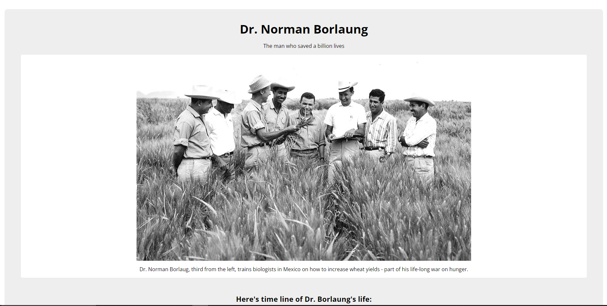

<h1 align="center"> Tribute Page </h1>

  <a href="#-tecnologias">Tecnologias</a>&nbsp;&nbsp;&nbsp;|&nbsp;&nbsp;&nbsp;
  <a href="#-projeto">Projeto</a>

 

  

## 🚀 Tecnologias

Esse projeto foi desenvolvido com as seguintes tecnologias:

- HTML e CSS
- Git e Github

## 💻 Projeto

página de tributo é o segundo projeto de certificação da freecodecamp no curso de Design responsivo para a web

- [Acesse o projeto finalizado, online](https://GustavoJeri.github.io/tribute-page)

